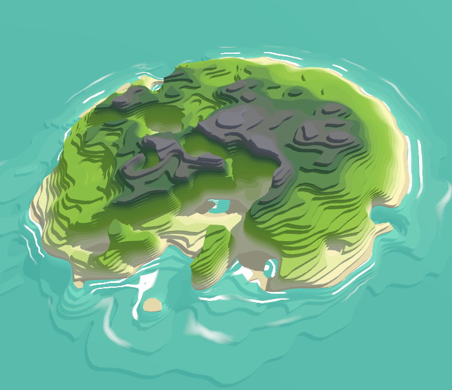
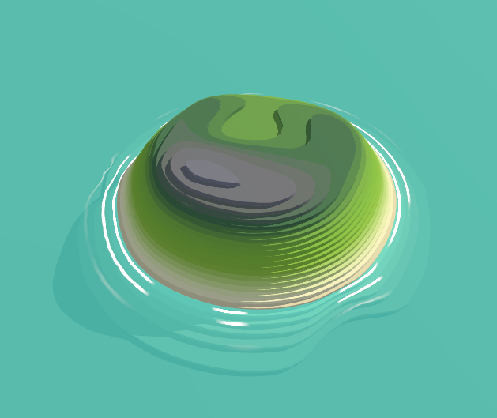
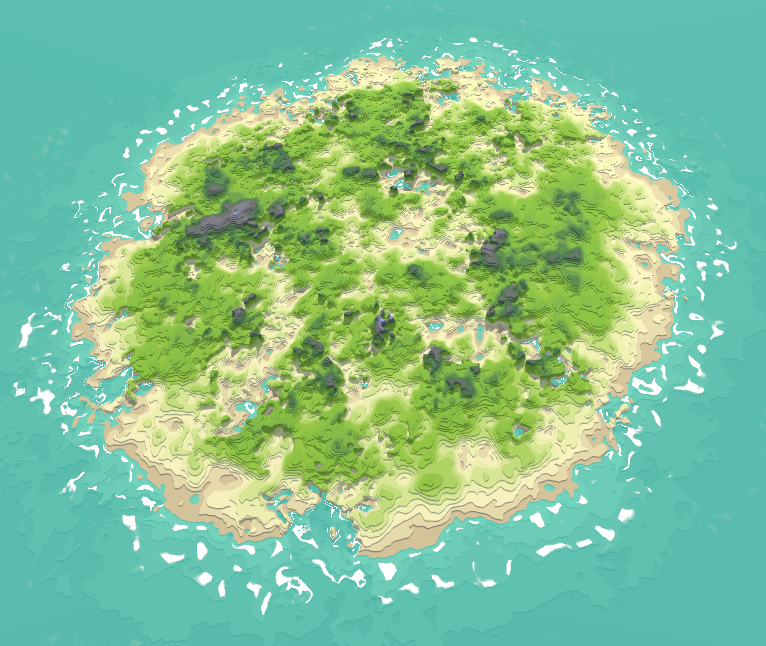
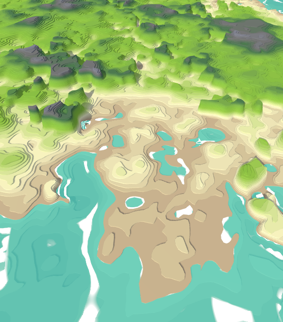

# islands

Procedurally generated noise based islands

The generator uses [marching squares](https://en.wikipedia.org/wiki/Marching_squares) to create layers, which are then extruded to 3D meshes

